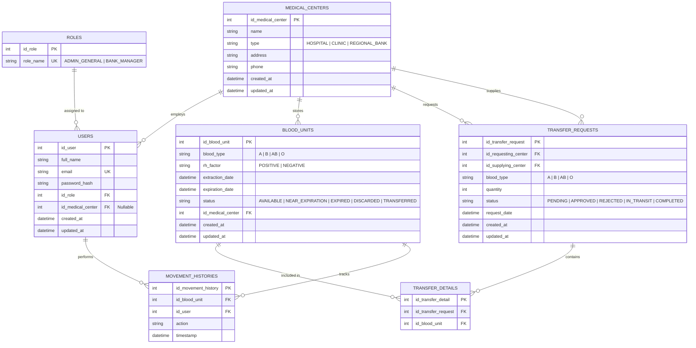

# Nexus Sanguinis - Modelo Entidad-Relación y Arquitectura de Datos 🩸

## Visión General
El modelo relacional de base de datos de **Nexus Sanguinis** implementa rigurosamente la **Tercera Forma Normal (3FN)**:
- **Primera Forma Normal (1FN)**: Todos los valores de los atributos son atómicos; se eliminan grupos repetitivos y arreglos dentro de columnas.
- **Segunda Forma Normal (2FN)**: Cumple 1FN y todos los atributos no clave tienen dependencia funcional completa respecto a las claves primarias.
- **Tercera Forma Normal (3FN)**: Cumple 2FN y no existen dependencias funcionales transitivas (ningún atributo no clave depende de otro atributo no clave).

Asimismo, todas las claves primarias y foráneas se adhieren al estándar estricto de nomenclatura: `id_<entity_name>`.

---

## Diagrama Entidad-Relación (Mermaid)

---

## Justificación Técnica de Normalización (3FN)

1. **Tabla `roles` vs `users`**: Desacopla la definición de roles y privilegios de la entidad de usuarios, previniendo redundancia y anomalías de modificación en accesos.
2. **Tabla `medical_centers`**: Centraliza hospitales, clínicas y bancos de almacenamiento, eliminando la duplicación de direcciones, teléfonos y tipos en las unidades físicas y el personal.
3. **Tabla `blood_units`**: Almacena el ciclo de vida unitario de cada bolsa de sangre (`id_blood_unit`) con trazabilidad atómica de tipo, factor Rh, fecha de extracción y caducidad.
4. **Tabla `transfer_details` (Entidad Puente)**: Normaliza la relación Muchos a Muchos entre solicitudes de transferencia y bolsas individuales, permitiendo asociar qué unidades físicas específicas satisfacen cada requisición sin redundar la cabecera del pedido.
5. **Tabla `movement_histories`**: Bitácora inmutable de solo adición (*append-only*), garantizando la auditoría cronológica y el no repudio de acciones operativas realizadas por cada usuario (`id_user`) sobre cada bolsa (`id_blood_unit`).
